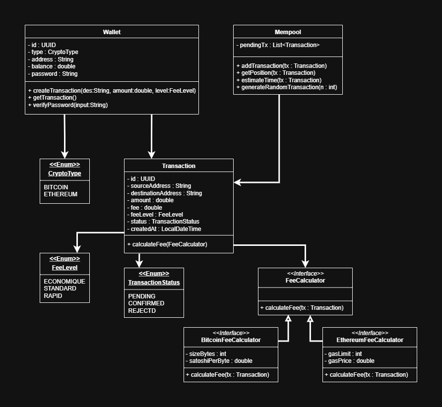

# 💰 Crypto Wallet Simulator

## 📌 Description du projet

Ce projet est une application console développée en **Java 8** permettant la simulation d’un portefeuille de cryptomonnaies (**Bitcoin & Ethereum**).
L’objectif est d’offrir un outil simple et éducatif qui reproduit les principales fonctionnalités d’un wallet crypto :

* Création de wallets sécurisés par mot de passe
* Authentification et gestion de plusieurs wallets
* Création de transactions avec calcul des frais (selon la crypto et le niveau choisi)
* Gestion d’un **mempool** simulé contenant les transactions en attente
* Consultation de la position et du temps estimé de confirmation d’une transaction

L’application respecte les principes **SOLID**, applique les patterns **Repository, Singleton, Strategy**, et utilise **JDBC + PostgreSQL** pour la persistance.

---

## 🔗 Liens utiles

* 📂 [Dépôt GitHub](https://github.com/Ibrahim-Nidam/Ibrahim_Nidam_Crypto_Wallet_Simulator.git)
* 📝 [Tableau Jira]()

---

## 🛠️ Technologies utilisées

* **Java 8 (JDK 1.8)**
* **Collections Java** (`ArrayList`, `HashMap`)
* **Stream API** (map, filter, reduce, Optional)
* **UUID** pour les identifiants uniques
* **JDBC + PostgreSQL** pour la base de données
* **java.util.logging** (ou SLF4J) pour le logging
* **Git & GitHub** pour la gestion de version

---

## 📂 Structure du projet

```
├── src/
│   ├── app/
│   │   └── Main.java              # Point d'entrée
│   │
│   ├── ui/                        # Interface console
│   │   ├── Menu.java
│   │   └── WalletMenu.java
│   │
│   ├── model/                     # Couche métier (entités)
│   │   ├── Wallet.java
│   │   ├── Transaction.java
│   │   ├── Mempool.java
│   │   └── enums/
│   │       ├── CryptoType.java
│   │       ├── FeeLevel.java
│   │       └── TransactionStatus.java
│   │
│   ├── service/                   # Logique métier
│   │   ├── FeeCalculator.java
│   │   ├── BitcoinFeeCalculator.java
│   │   └── EthereumFeeCalculator.java
│   │
│   ├── repository/                # Accès DB (Pattern Repository)
│   │   ├── WalletRepository.java
│   │   └── TransactionRepository.java
│   │
│   └── util/                      # Outils
│       ├── DBConnection.java      # Singleton JDBC
│       └── Validator.java         # Validation adresses, montants, mot de passe
│
├── resources/
│   ├── schema.sql                 # Script création base
│   └── config.properties          # Connexion DB
│
├── docs/
│   └── architecture.png           # Diagramme UML
│
└── README.md
```

---

## ⚙️ Fonctionnalités principales

✅ Créer un wallet (adresse générée automatiquement, mot de passe associé)
✅ Lister les wallets existants et se connecter via mot de passe
✅ Créer une transaction (BTC/ETH) avec frais dynamiques
✅ Choisir le niveau de frais (**Économique, Standard, Rapide**)
✅ Ajouter les transactions dans un **mempool** simulé
✅ Vérifier la position d’une transaction dans le mempool
✅ Estimer le temps de confirmation
✅ Persistance PostgreSQL (wallets + transactions)
✅ Validation des montants et adresses

---

## 📋 Prérequis

* **JDK 1.8** installé (`java -version` doit afficher 1.8.x)
* **PostgreSQL** installé et accessible
* **Un IDE** (Eclipse, IntelliJ, VS Code)
* **Git** pour cloner le projet

---

## 🚀 Installation & Exécution

1. **Cloner le dépôt GitHub :**

   ```bash
   git clone https://github.com/Ibrahim-Nidam/Ibrahim_Nidam_Crypto_Wallet_Simulator.git
   cd Ibrahim_Nidam_Crypto_Wallet_Simulator
   ```

2. **Créer la base de données PostgreSQL :**

   ```sql
   CREATE DATABASE crypto_wallet;
   ```

3. **Configurer la connexion DB** dans `resources/config.properties` :

   ```
   db.url=jdbc:postgresql://localhost:5432/crypto_wallet
   db.user=postgres
   db.password=monMotDePasse
   ```

4. **Compiler le projet :**

   ```bash
   javac -d bin $(find src -name "*.java")
   ```

5. **Exécuter l’application :**

   ```bash
   java -cp bin app.Main
   ```

6. **Générer un JAR exécutable :**

   ```bash
   jar cvfe wallet.jar app.Main -C bin .
   java -jar wallet.jar
   ```

---

📊 Diagramme de classes



---

✅ Critères de performance

* Développé uniquement avec **Java 8**
* Respect de l’architecture en couches
* Application des patterns demandés (**Repository, Singleton, Strategy**)
* Persistance via **PostgreSQL + JDBC**
* Code clair, bien commenté et testé
* Logging centralisé (pas de `System.out.println` hors UI)
* README complet et explicatif

---

📅 Gestion de projet

Durée : **22/09/2025 → 30/09/2025** (7 jours)

**Outils :**

* GitHub pour versioning
* Jira pour suivi des tâches
* Modalités d’évaluation :

  * Présentation technique et client
  * Démonstration des fonctionnalités
  * Questions / Réponses

---